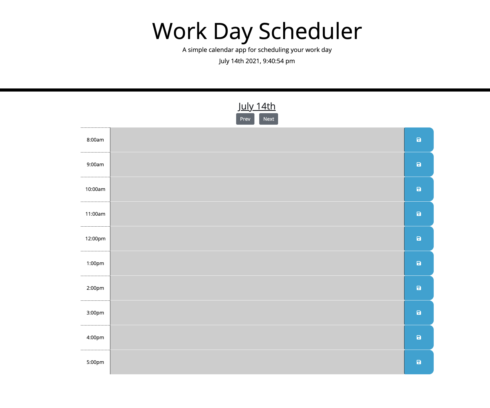

# Work_Day_Scheduler

Homework_5

# Description / Overview

Simple calendar application that allows users to input events for each hour
of the day with dynamic features with the time of day coloring for the textarea, running date / time, and allowing users to save information they input.

# Libaries / Framworks Used

* jQuery
* Bootstrap
* Moment

# Application Screenshot

# Github Pages link

https://chasenicks.github.io/Work_Day_Scheduler/